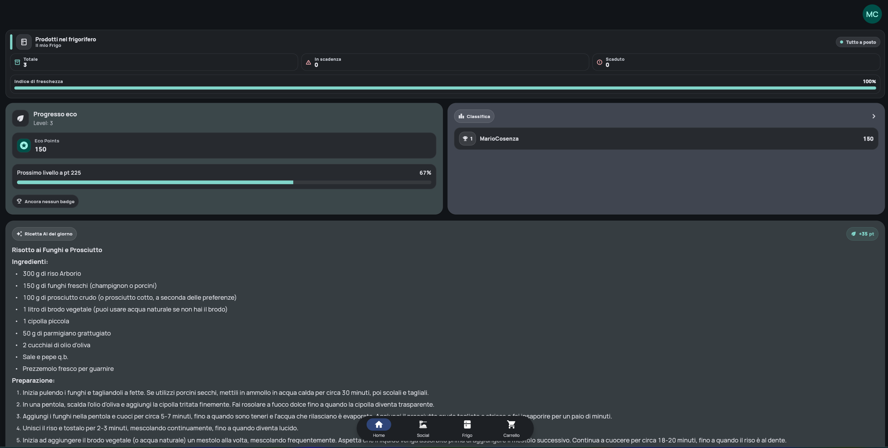

# MOCC - Meal Optimizer Cloud Chef

<p align="center">
  
</p>

<p align="center">
  <b>Smart Inventory. Generative Recipes. Social Cooking.</b>
</p>

<p align="center">
  <a href="https://github.com/mariocosenza/mocc/actions/workflows/deploy_backend.yml"></a>
  <a href="https://github.com/mariocosenza/mocc/actions/workflows/deploy_function.yml"></a>
  <a href="https://github.com/mariocosenza/mocc/actions/workflows/deploy_static.yml"></a>
</p>

<p align="center">
  
  
  
  
  
</p>

**MOCC** is a cloud-native application designed to revolutionize kitchen management. By leveraging **Artificial Intelligence**, **Computer Vision**, and **Real-Time Connectivity**, MOCC allows users to manage their inventory, minimize food waste, and discover personalized recipes.

<p align="center">
  
  <br>
  <i>MOCC Home Screen Dashboard</i>
</p>

---

## 🛠️ Technology Stack

MOCC is built on a modern, polyglot architecture:

### Frontend (Flutter)
- **Framework**: Flutter (Mobile & Web Support).
- **State Management**: `flutter_riverpod` for reactive and testable state.
- **Navigation**: `go_router` for declarative routing and deep linking.
- **API Client**: `graphql_flutter` with robust caching and offline support.
- **Auth**: `msal_auth` / `msal_js` for Microsoft Entra ID integration.
- **Localization**: `easy_localization` for multi-language support.

### Backend (Go)
- **Runtime**: Go 1.22+ containerized with Docker.
- **API**: GraphQL server using `99designs/gqlgen`.
- **Hosting**: **Azure Container Apps (ACA)** with KEDA auto-scaling (Scale-to-Zero).
- **Security**: Keyless access to Azure resources via Managed Identities.

### Event Processing (Python)
- **Runtime**: Python 3.12 on **Azure Functions (Flex Consumption)**.
- **AI & ML**: 
  - **Azure AI Document Intelligence** for converting receipts to structured data.
  - **Azure OpenAI (GPT-4o)** for generative recipe creation.
  - **Azure Content Safety** for moderating social posts.
- **Triggers**: Event Grid blobs, Timers, and Storage Queues.

### Infrastructure (Azure)
- **IaC**: Entirely managed via **Bicep** templates.
- **Gateway**: **Azure API Management** (Consumption) as the single entry point.
- **Database**: **Azure Cosmos DB** (NoSQL) with auto-scaling (400 RU/s cap).
- **Caching**: **Azure Redis Cache** for session and data caching.
- **Real-Time**: **Azure SignalR Service** and **Notification Hubs** (Firebase FCM).

---

## 📂 Project Structure

A quick overview of the repository organization:

```text
MOCC/
├── app/                  # Frontend (Flutter)
│   ├── lib/              # Dart source code
│   └── web/              # Web configuration
├── backend/              # Backend (Go + GraphQL)
│   ├── graph/            # GraphQL schema & resolvers
│   ├── internal/         # Business logic
│   └── server.go         # API Entrypoint
├── functions/            # Azure Functions (Python)
│   ├── services/         # AI & Event logic
│   └── function_app.py   # Triggers definition
├── infrastructure/       # Infrastructure as Code (Bicep)
│   ├── modules/          # Resources definitions
│   └── scripts/          # Deployment scripts
└── documentation/        # Diagrams and assets
```

---

## 🏗️ Architecture & Security

### System Architecture
A high-level structural overview of the cloud-native solution, illustrating the interaction between the Flutter Frontend, the API Gateway, and the underlying microservices hosted on Azure Container Apps and Functions.


### Azure Functions Workflow
Visualizes the event-driven architecture where **Azure Functions** orchestrate complex tasks like receipt OCR processing (Document Intelligence), recipe generation (OpenAI GPT-4), and content moderation, triggered by **Event Grid** events from Blob Storage.


### Security (RBAC)
MOCC uses a Zero-Trust approach. Services communicate via **Managed Identities** and RBAC assignments (e.g., *Storage Blob Data Contributor*) without hardcoded secrets.


---

## 🚀 Deployment Guide

### Prerequisites
1. **Azure CLI**: Logged in to your target subscription.
2. **GitHub Account**: For CI/CD workflows.
3. **Firebase Project**: An active Firebase project with `google-services.json` generated.
4. **Tools**: Docker, Go, Flutter, Node.js installed locally for development.

### 1. Full Deployment
Deploy the entire stack (Infrastructure, Functions, Policies, Frontend) using the master script.

**Windows (Batch):**
```batch
.\infrastructure\scripts\DeployAll.bat
```

> **Note**: For infrastructure-only updates, use `DeployMain.bat`.

### 2. GitHub Configuration (Secrets)
The CI/CD pipelines depend on strict configuration. Add the following **Repository Secrets** to your GitHub repo:

| Category | Secret Name | Description |
|---|---|---|
| **Identity** | `AZURE_CREDENTIALS` | JSON output from `az ad sp create-for-rbac ...` |
| | `AUTH_CLIENT_ID` | The Client ID of your App Registration (Frontend) |
| | `AUTH_AUTHORITY` | The Authority URL (e.g., `https://login.microsoftonline.com/...`) |
| | `AUTH_API_SCOPES` | The Scopes for Frontend (e.g., `api://<backend-id>/access_as_user`) |
| | `EXPECTED_AUDIENCE` | The Audience for Backend validation (same as Client ID usually) |
| | `MANAGED_IDENTITY_CLIENT_ID` | The Client ID of the User Assigned Managed Identity (for Backend) |
| **Connecting** | `MOCC_API_URL` | The public URL of your Backend (Container App) |
| | `AZURE_STATIC_WEB_APPS_API_TOKEN` | Deployment token for SWA (found in Portal overview) |
| | `COSMOS_URL` | The connection string or endpoint for Cosmos DB |
| | `REDIS_URL` | The connection string for Azure Redis Cache |
| | `AZURE_STORAGE_ACCOUNT_NAME` | The name of the main Storage Account |
| | `EVENTGRID_TOPIC_ENDPOINT` | The Endpoint URL for the Event Grid Topic |
| **Functions** | `AzureWebJobsStorage__accountName` | Storage Account Name for Functions runtime |
| | `AzureWebJobsStorage__credential` | Storage Account Key/Credential for Functions |
| | `AZURE_OPENAI_ENDPOINT` | Endpoint for Azure OpenAI Service |
| | `DOCUMENT_INTELLIGENCE_ENDPOINT` | Endpoint for Document Intelligence Service |
| | `KEY_VAULT_URL` | URL of the Key Vault (if used) |
| **Base64 Configs** | `FIREBASE_OPTIONS_BASE64` | Base64 encoded `firebase_options.dart` |
| | `FIREBASE_MESSAGING_SW_BASE64` | Base64 encoded `firebase-messaging-sw.js` |
| | `MSAL_CONFIG_BASE64` | Base64 encoded `msal_config.json` |

### 3. Static Web App (Manual Step)
Since the **Azure Static Web App (SWA)** URL is generated dynamically upon creation, you must whitelist it in your **Entra ID App Registration** to allow authentication redirects.

1. Go to the Azure Portal > **Static Web Apps**.
2. Copy the URL of the deployed `mocc-swa` (e.g., `https://purple-moss-012345.azurestaticapps.net`).
3. Go to **Entra ID** > **App Registrations** > Your Client App > **Authentication**.
4. Under **Single-page application**, Add the following **Redirect URIs**:
   - `https://<your-swa-url>`
   - `https://<your-swa-url>/auth.html` (Required for popup auth flows)

> **Note**: Without this step, users will encounter AADSTS50011 errors during login on the Web version.

---

## 🧪 Local Development

### Prerequisites
Ensure the following tools are installed:
- **Docker**: For running containerized dependencies (Redis).
- **Go 1.22+**: For the backend API.
- **Flutter**: For the frontend application.
- **Python 3.12+**: For Azure Functions.
- **Azure CLI (`az`)**: Managed identity and login.
- **Azure Functions Core Tools (`func`)**: For running functions locally.
- **Azurite**: For emulating Azure Storage.

### 1. Start Emulators
MOCC requires storage and caching emulators for local runs.

**Azure Storage (Azurite)**
```bash
# Install via NPM if needed: npm install -g azurite
azurite --silent --location .azurite --debug .azurite/debug.log
```

**Redis Cache**
```bash
docker run --name redis -p 6379:6379 -d redis
```

### 2. Run Backend Services
**Go API Server** (Port 8080)
```bash
cd backend
go mod tidy
go run server.go
```

**Azure Functions** (Port 7071)
```bash
cd functions
# Create a python virtual environment if first time
# python -m venv .venv
# .venv\Scripts\activate
# pip install -r requirements.txt
func start
```

### 3. Run Frontend
```bash
cd app
flutter pub get
flutter run -d chrome
```

### 4. Simulating Event Grid
You can trigger local Azure Functions (e.g., Recipe Generation) by simulating Event Grid webhooks without deploying to Azure.

1. Ensure your Function App is running locally on port **7071**.
2. Edit `functions/simulate_event.ps1` to set your target `userId` and `filename`.
3. Run the simulation script:

```powershell
./functions/simulate_event.ps1
```

This sends a mock `Microsoft.Storage.BlobCreated` event to `http://localhost:7071/runtime/webhooks/EventGrid`, triggering the function logic.

---

Developed with ❤️ for MOCC.